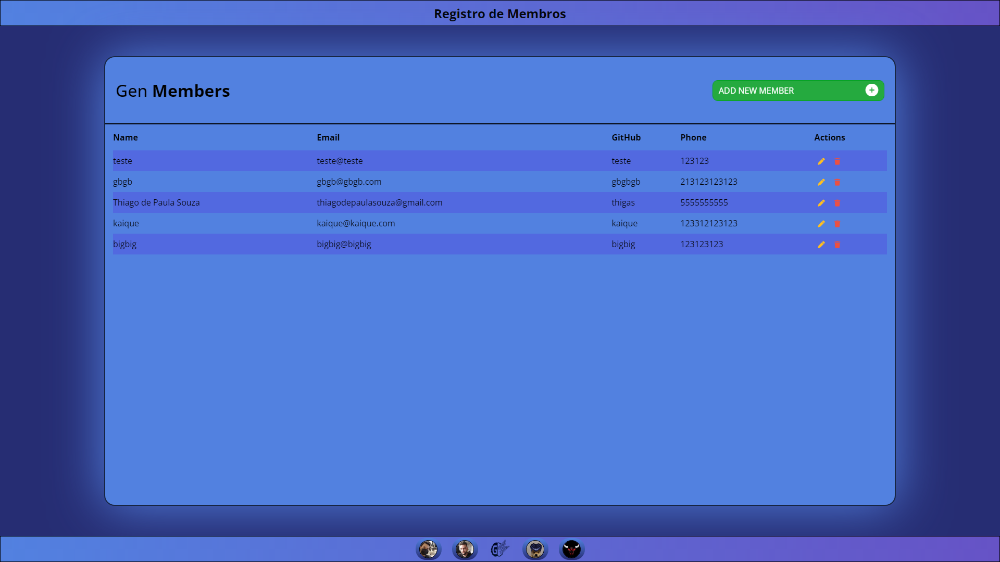
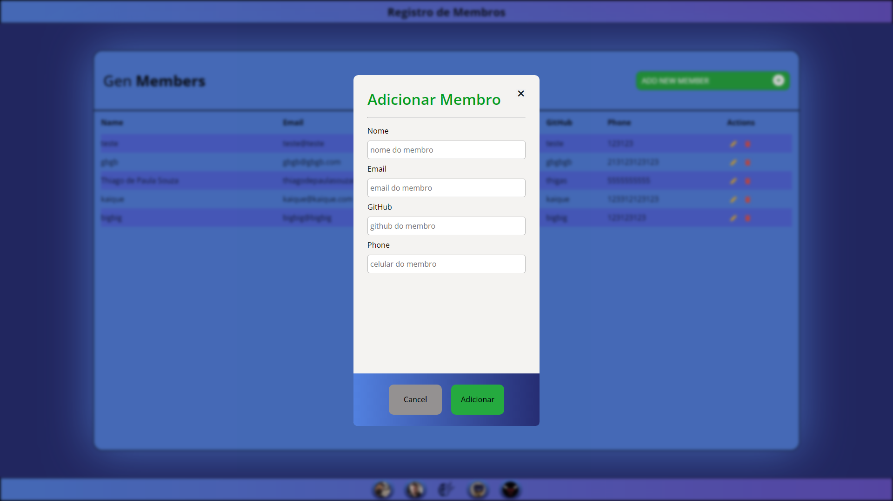
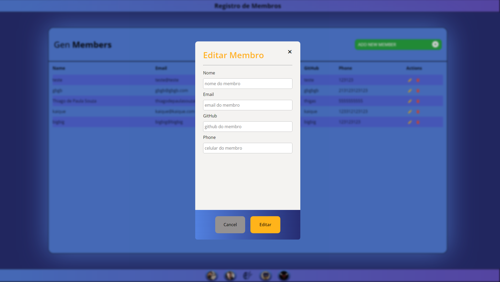
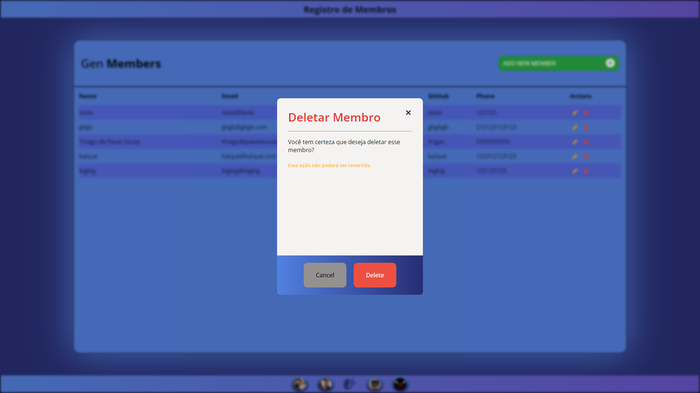

<div id="top"></div>

# gen crud web


## About the project
Crud of Gen members. The Gen member control screen, to have better control of members, being able to add, remove and edit member information.

<details>
  <summary><strong>project's images</strong></summary>
  <ul>
    
    
    
  </ul>
</details>

##### Tecnologies: 
- [Html](https://developer.mozilla.org/pt-BR/docs/Web/HTML), [Css](https://developer.mozilla.org/pt-BR/docs/Web/css), [Javascript](https://developer.mozilla.org/pt-BR/docs/Web/JavaScript)
- [Postgresql 14](https://www.postgresql.org)
- [ASP.NET Core 6](https://docs.microsoft.com/pt-br/aspnet/core/?view=aspnetcore-6.0)

## 🧙‍♂️ How to run
##### 1. Downloads & Dependencies:
- Download [Postgresql 14](https://www.postgresql.org/download/)
- Clone and run this [API](https://github.com/geracao/gen-crud-api) (follow api readme)

##### 2. Clone and Run:
```bash
git clone https://github.com/geracao/gen-crud-web.git
```
- Run the project
- Enjoy 😄

## 👩‍💻 How to help
##### 1. Before anything:
Fork the project

```bash
# setup your git | don't forget to remove the ()
git clone (YourUrlProject)
git remote add origin (YourUrlProject)
git pull
git checkout developer
git checkout -b (YourBranch)
```

##### 2. After your amazing feature:
[Follow the pattern of Conventional Commits 🕵️‍♀️](https://www.conventionalcommits.org/en/v1.0.0/) (not required) 
```bash
# after changes | don't forget to remove the () <>
git status
git add (FileThatYouChange)
git commit -m ("<type>: <description>")
git push -u origin (YourBranch)
```

##### 3. Now in your repository fork:
- Click on **Contribute**
- Click on **Compare & pull request**
- Write about your changes
- Click on **Create pull request**


## :memo: License
This project is under the MIT license. See the [LICENSE](./LICENSE) file for more details.

<p align="right">(<a href="#top">back to top</a>)</p>
